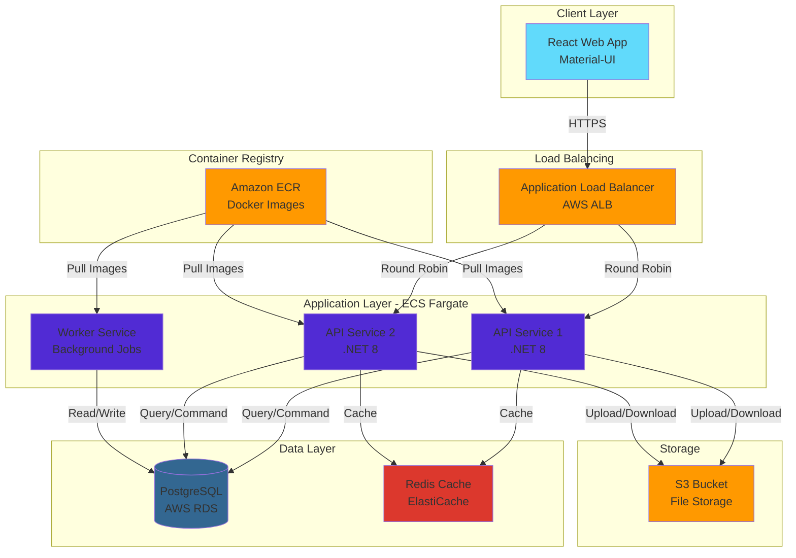
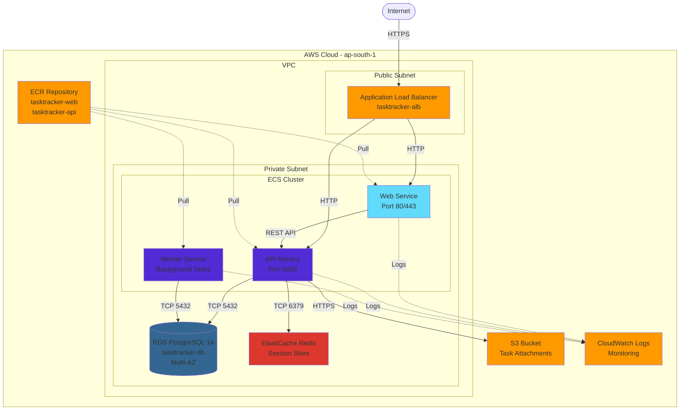
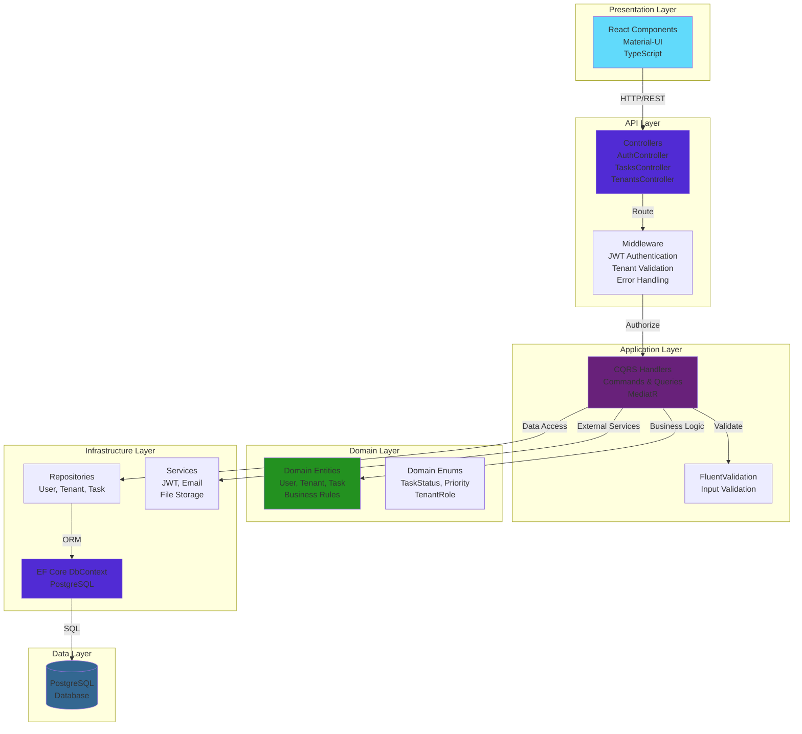
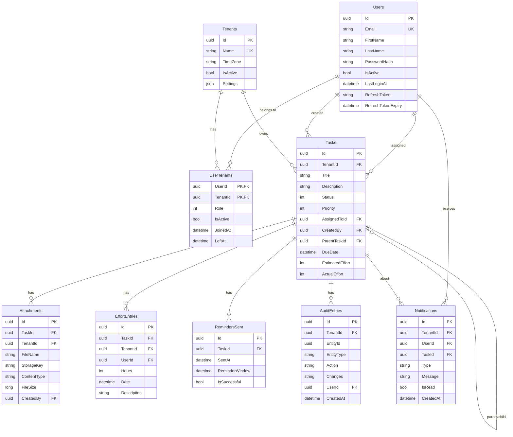
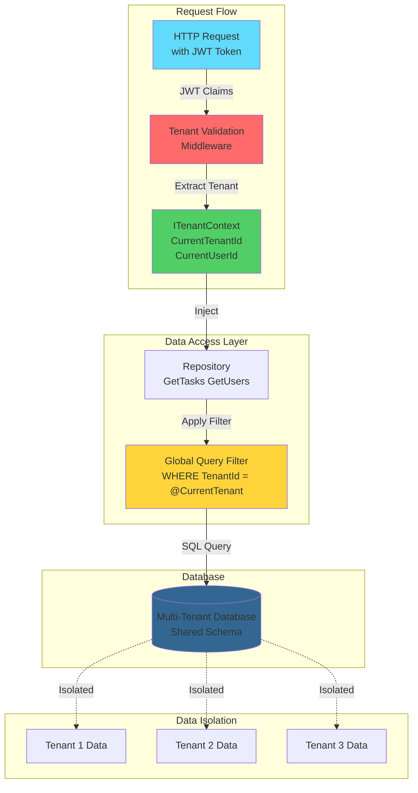
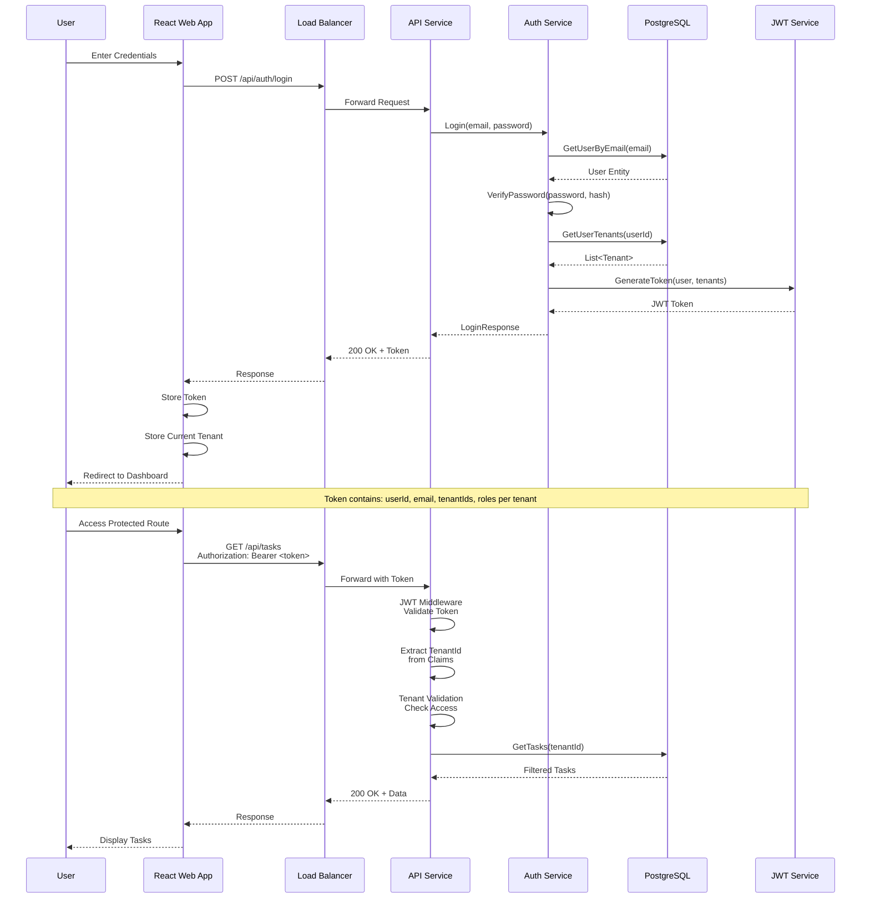
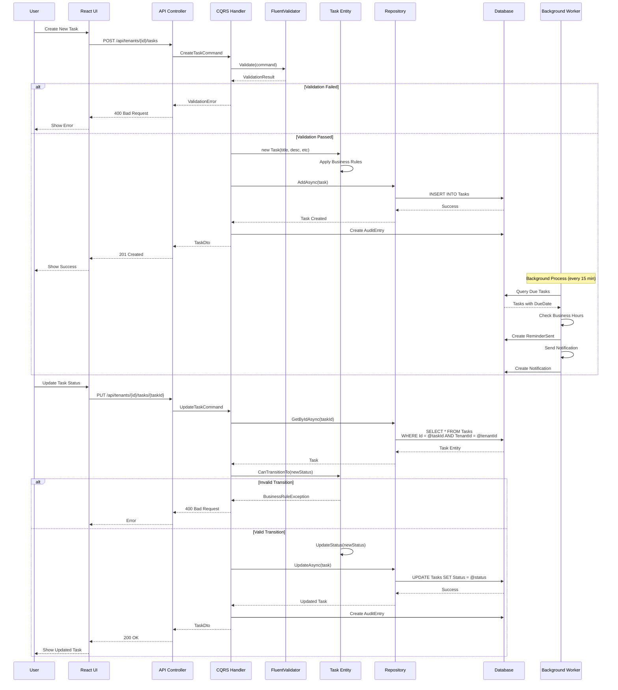
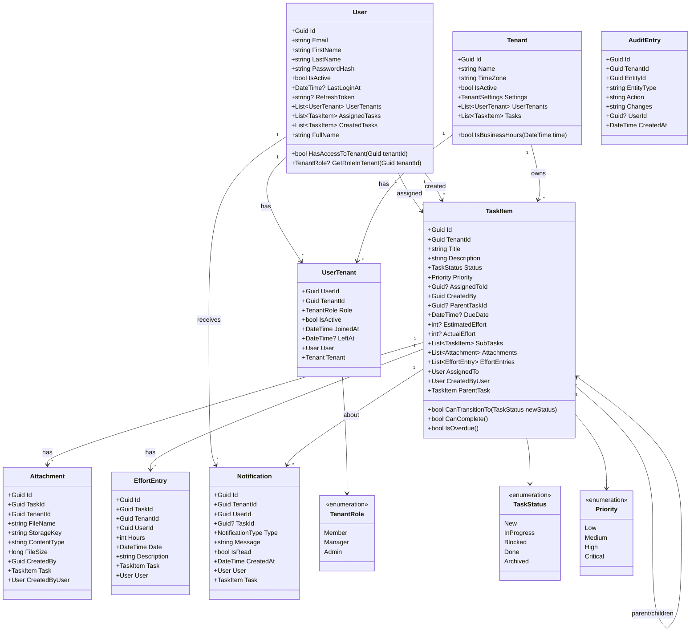
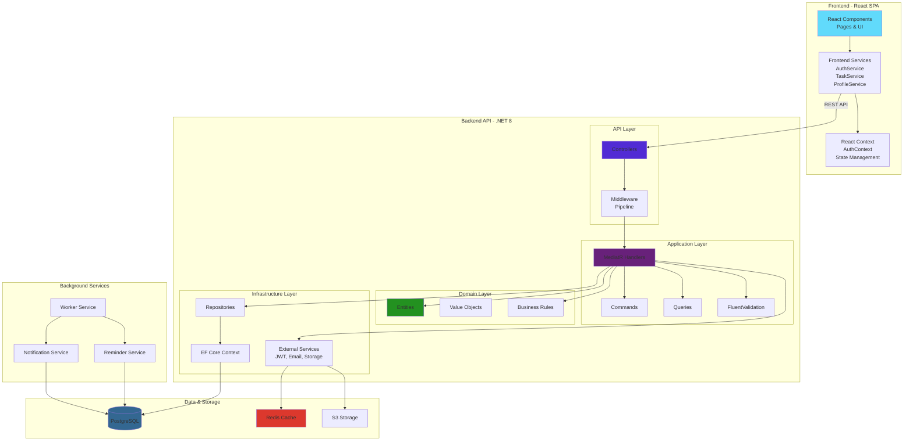
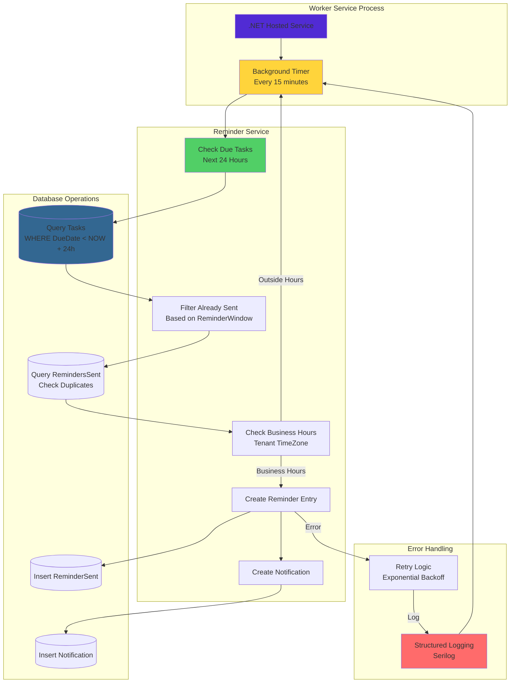

# TaskTracker - Architecture & Design Diagrams

## Table of Contents
1. [System Architecture](#1-system-architecture)
2. [AWS Deployment Architecture](#2-aws-deployment-architecture)
3. [Application Layers](#3-application-layers)
4. [Database Schema](#4-database-schema)
5. [Multi-Tenancy Architecture](#5-multi-tenancy-architecture)
6. [Authentication Flow](#6-authentication-flow)
7. [Task Management Flow](#7-task-management-flow)
8. [Class Diagram - Domain Entities](#8-class-diagram---domain-entities)
9. [Component Diagram](#9-component-diagram)
10. [Background Services Architecture](#10-background-services-architecture)

---

## 1. System Architecture

---

## 2. AWS Deployment Architecture

---

## 3. Application Layers

---

## 4. Database Schema

---

## 5. Multi-Tenancy Architecture

### Multi-Tenancy Features:
- **Shared Database**: All tenants in single database with TenantId column
- **Query Filtering**: EF Core global filters ensure tenant isolation
- **JWT-Based Context**: Current tenant extracted from JWT claims
- **Role-Based Access**: Different roles per tenant (Member/Manager/Admin)
- **Tenant Switching**: Users can switch between tenants they belong to

---

## 6. Authentication Flow

---

## 7. Task Management Flow

---

## 8. Class Diagram - Domain Entities

---

## 9. Component Diagram

---

## 10. Background Services Architecture

### Background Service Features:
- **Scheduled Execution**: Runs every 15 minutes
- **Idempotency**: ReminderWindow prevents duplicate reminders
- **Business Hours**: Respects tenant timezone settings
- **Error Handling**: Exponential backoff with structured logging
- **Graceful Shutdown**: Proper cancellation token handling

---

## Key Architecture Principles

### 1. **Clean Architecture**
- Clear separation of concerns across layers
- Domain layer has no external dependencies
- Infrastructure depends on abstractions

### 2. **Multi-Tenancy**
- Shared database with tenant isolation
- Query filters ensure data separation
- JWT-based tenant context

### 3. **CQRS Pattern**
- Commands for writes (Create/Update/Delete)
- Queries for reads (Get/List)
- MediatR for handler orchestration

### 4. **Repository Pattern**
- Abstraction over data access
- Testability through interfaces
- Specification pattern for complex queries

### 5. **Security**
- JWT authentication with tenant claims
- Role-based authorization per tenant
- Input validation with FluentValidation
- XSS/SQL injection protection

### 6. **Scalability**
- Stateless API services (horizontal scaling)
- Redis caching for performance
- ECS Fargate auto-scaling
- Database read replicas (future)

### 7. **Observability**
- Structured logging (Serilog)
- CloudWatch metrics
- Correlation IDs for request tracing
- Health checks

---

## Technology Stack Summary

| Layer | Technology |
|-------|------------|
| **Frontend** | React 18, TypeScript 5.9, Material-UI 5 |
| **API** | ASP.NET Core 8, C# 12 |
| **Database** | PostgreSQL 14 |
| **ORM** | Entity Framework Core 8 |
| **Caching** | Redis (ElastiCache) |
| **Storage** | AWS S3 |
| **Containerization** | Docker, Multi-stage builds |
| **Orchestration** | AWS ECS Fargate |
| **Load Balancing** | AWS Application Load Balancer |
| **CI/CD** | Docker, AWS ECR, ECS |
| **Monitoring** | AWS CloudWatch |
| **Patterns** | CQRS, Repository, Clean Architecture |

---

## Deployment Configuration

### Production Environment
- **Region**: ap-south-1 (Mumbai)
- **Load Balancer**: tasktracker-alb-1161871022
- **ECS Cluster**: tasktracker-cluster
- **Database**: tasktracker-db (Multi-AZ)
- **ECR Repository**: 141820512164.dkr.ecr.ap-south-1.amazonaws.com

### Scaling Configuration
- **API Service**: Auto-scale 1-4 instances
- **Web Service**: Auto-scale 1-4 instances
- **Database**: db.t3.medium with Multi-AZ
- **Target CPU**: 70% utilization

---

*Generated: December 17, 2025*
*Version: 1.0*
